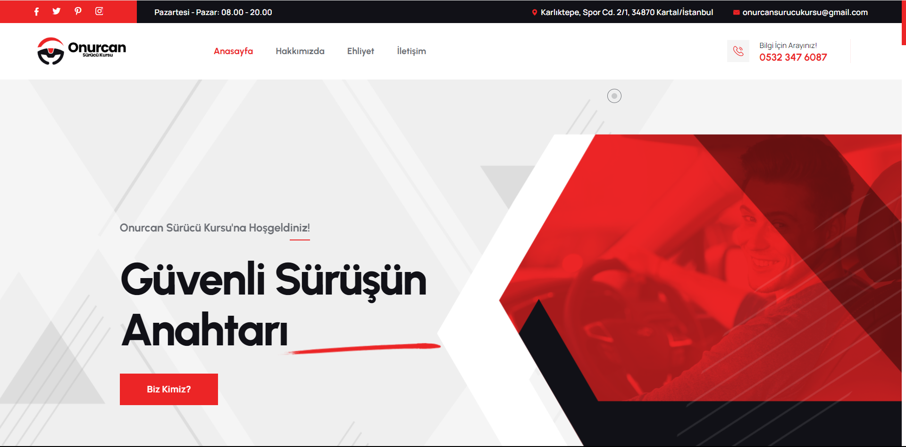
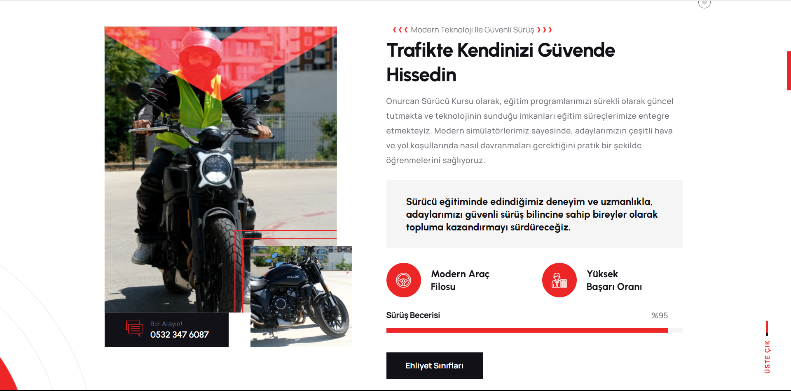

<h1 style="color:#3498db;">🚗 Onurcan Sürücü Kursu Web Sitesi</h1>

<strong style="color:#e74c3c;">Proje:</strong> Onurcan Sürücü Kursu Web Sitesi

<strong style="color:#e74c3c;">Müşteri:</strong> Onurcan Sürücü Kursu (2005'ten beri İstanbul Kartal'da hizmet veren köklü bir sürücü kursu)

<strong style="color:#e74c3c;">Hedef:</strong> Kullanıcı dostu, SEO uyumlu, modern ve güvenilir bir web sitesi tasarlamak

<h2 style="color:#2ecc71;">Proje Özeti</h2>

Bu proje, İstanbul Kartal'da yer alan Onurcan Sürücü Kursu için profesyonel bir web sitesi geliştirmeyi hedeflemektedir. Web sitesi, kursun hizmetlerini tanıtmak, potansiyel müşterilere ulaşmak ve online kayıt işlemlerini kolaylaştırmak amacıyla tasarlanmıştır.

<h2 style="color:#2ecc71;">Öne Çıkan Özellikler</h2>
<ul>
    <li><strong style="color:#f39c12;">SEO Uyumlu İçerik:</strong> Arama motorlarında daha iyi sıralamalar elde etmek için optimize edilmiş metinler ve görseller.</li>
    <li><strong style="color:#f39c12;">Kullanıcı Dostu Arayüz:</strong> Ziyaretçilerin kolayca bilgi bulmasını ve siteyi rahatça gezmesini sağlayan sade ve anlaşılır bir tasarım.</li>
    <li><strong style="color:#f39c12;">Duyarlı Tasarım:</strong> Hem masaüstü hem de mobil cihazlar için optimize edilmiş, tüm ekran boyutlarına uyum sağlayan esnek yapı.</li>
    <li><strong style="color:#f39c12;">Gelişmiş İletişim Formu:</strong> Ziyaretçilerin sorularını hızlıca iletebileceği, etkili bir iletişim aracı.</li>
</ul>

<h2 style="color:#2ecc71;">Görseller</h2>

Proje hakkında daha fazla bilgi edinmek için aşağıdaki görselleri inceleyebilirsiniz:

<!-- Görsel 1 -->

<!-- Görsel 2 -->

<h2 style="color:#2ecc71;">Websitesi Linki</h2>

Projeyi canlı olarak görmek için <a href="https://www.ornek-domein.com" target="_blank" style="color:#2980b9; text-decoration: none;">buraya tıklayın</a>.

<h2 style="color:#2ecc71;">Notlar</h2>

Bu proje, müşteri talebi doğrultusunda özel olarak geliştirildiği için kaynak kodları bu depoda paylaşılmamaktadır. Ancak proje hakkında daha fazla bilgi almak veya benzer bir çalışma talep etmek isterseniz, benimle iletişime geçebilirsiniz.

<h2 style="color:#2ecc71;">İletişim</h2>

Bu projeyle ilgili detaylar veya yeni projeler hakkında bilgi almak için <a href="mailto:bugrabatuhanbasar@gmail.com" style="color:#c0392b; text-decoration: none;">buradan</a> bana ulaşabilirsiniz.

<em>Bu proje, Onurcan Sürücü Kursu'nun dijital dünyada daha görünür olmasını sağlamak için tasarlanmıştır.</em>

